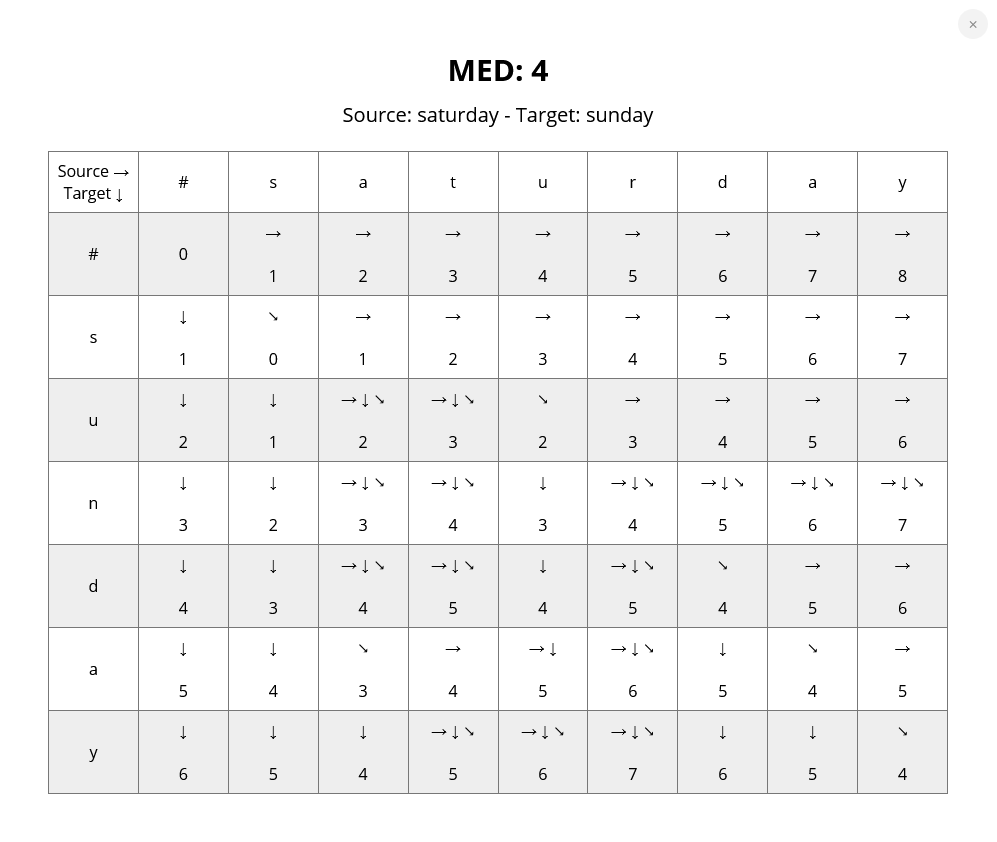

# Description

Calculate MED and draw the MED table and its movements for two strings

**MED:** Minimum Edit Distance ([Levenshtein Distance](https://en.wikipedia.org/wiki/Levenshtein_distance))

The substitution cost in this project is considered **2**. You can change it from `src/App.js` line 7.

## Example:

## Run the project

In the project directory, you can run:

### `npm start`

Runs the app in the development mode.\
Open [http://localhost:3000](http://localhost:3000) to view it in your browser.